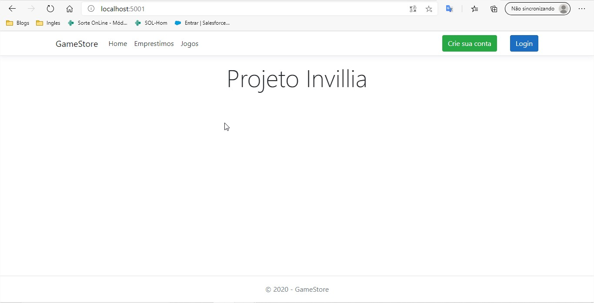
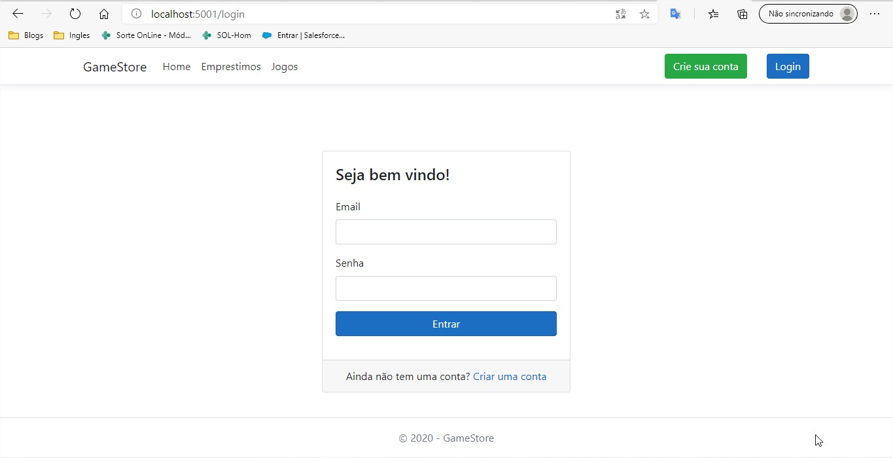
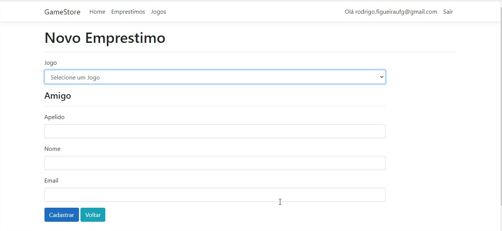
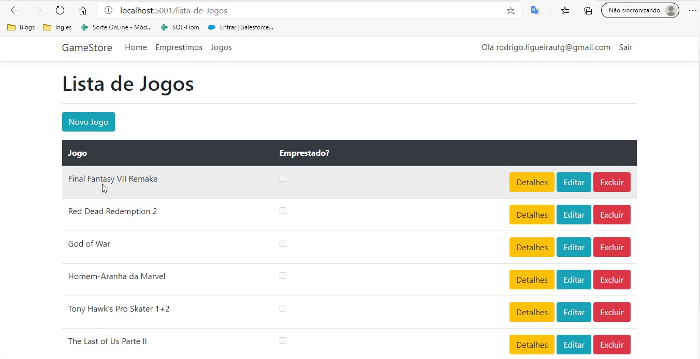
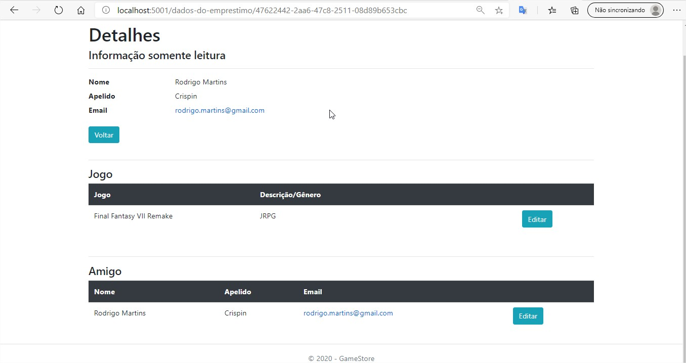
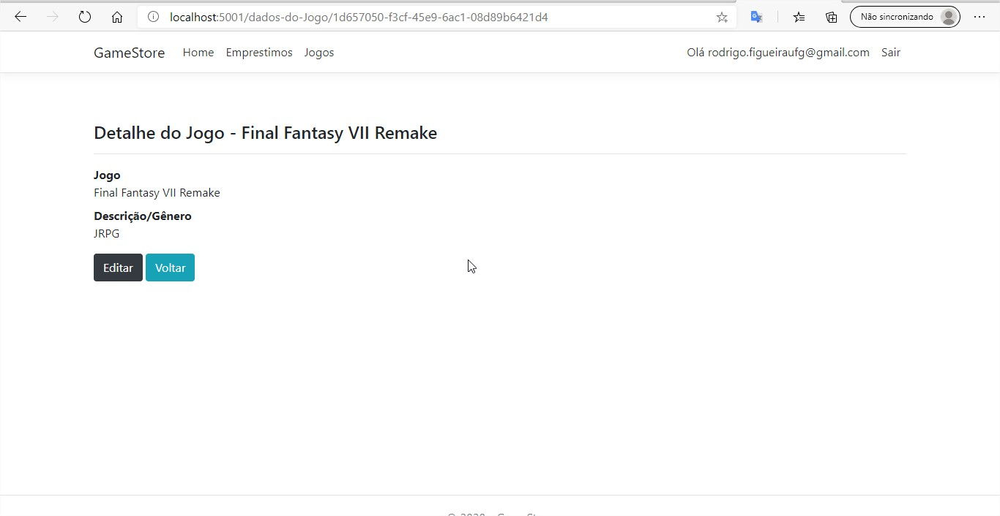

## Teste InVillia

Projeto de teste para vaga de Dev .NET na Invillia.
 
A aplicação é composta de uma API desenvolvida em .NET Core com base de dados em SQLServer.

## Requisitos

- [Git](https://git-scm.com/)
- [Docker](https://www.docker.com/) 
- [.NET Core](https://dotnet.microsoft.com/) (somente para uso sem Docker)
- [Visual Studio](https://visualstudio.microsoft.com/pt-br/vs/) ou [Visual Studio Code](https://code.visualstudio.com/)

## Docker

1. Clone o projeto na sua máquina

2. Rode o docker-compose up 
Acessando o **src/Docker** e digitando **docker-compose up**

3. Acesse sua aplicação em http://localhost:5001 to access the application

4. Para finalizar e fechar as imagens/containner
**Run docker-compose down --rmi all** 

## Exemplos

Abaixo seguem algumas telas de exemplo da aplicação. 

#### Home 

#### Login 

#### Cadastro de Emprestimo 

#### Lista de Jogos 

#### Emprestimo 

#### Jogos 

